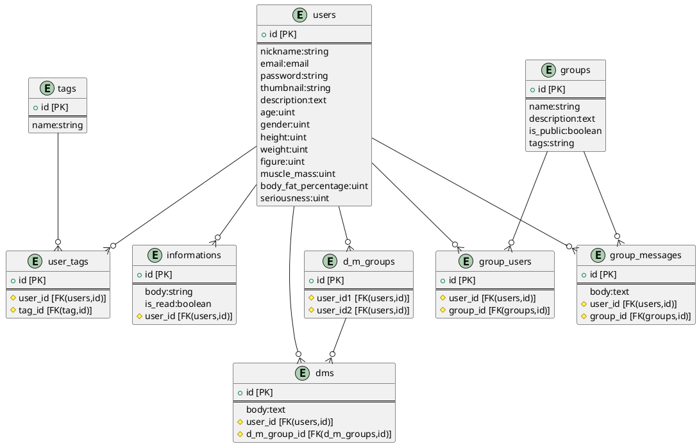

# ER図

```puml
@startuml

entity "users" {
    + id [PK]
    ==
    nickname:string
    email:email
    password:string
    thumbnail:string
    description:text
    age:uint
    gender:uint
    height:uint
    weight:uint
    figure:uint
    muscle_mass:uint
    body_fat_percentage:uint
    seriousness:uint
}

entity "informations" {
    + id [PK]
    ==
    body:string
    is_read:boolean
    # user_id [FK(users,id)]
}
users --o{ informations

entity "tags" {
    + id [PK]
    ==
    name:string
}

entity "user_tags" {
    + id [PK]
    ==
    # user_id [FK(users,id)]
    # tag_id [FK(tag,id)]
}
users --o{ user_tags
tags --o{ user_tags

entity "groups" {
    + id [PK]
    ==
    name:string
    description:text
    is_public:boolean
    tags:string
}

entity "group_users" {
    + id [PK]
    ==
    # user_id [FK(users,id)]
    # group_id [FK(groups,id)]
}
users --o{ group_users
groups --o{ group_users

entity "group_messages" {
    + id [PK]
    ==
    body:text
    # user_id [FK(users,id)]
    # group_id [FK(groups,id)]
}
groups --o{ group_messages
users --o{ group_messages

entity "dms" {
    + id [PK]
    ==
    body:text
    # user_id [FK(users,id)]
    # d_m_group_id [FK(d_m_groups,id)]
}

entity "d_m_groups" {
    + id [PK]
    ==
    # user_id1 [FK(users,id)]
    # user_id2 [FK(users,id)]
}
users --o{ d_m_groups
d_m_groups --o{ dms
users --o{ dms

@enduml
```